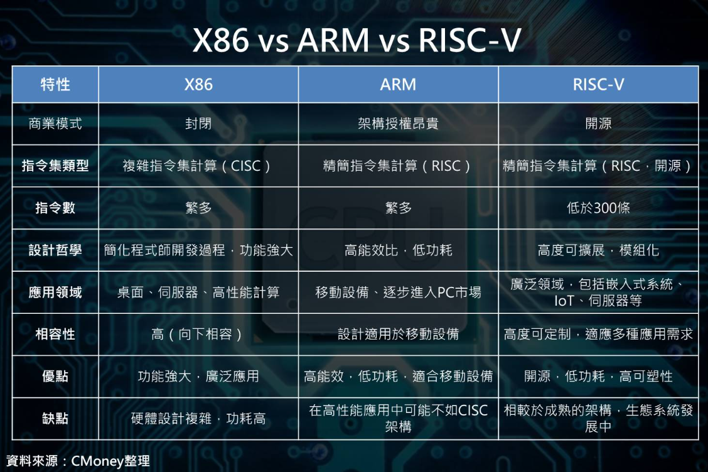

# 本书前言

## **安卓的本质：一台随身 Unix 计算机**

从技术结构上看，安卓表面上是一款「手机系统」，但它的核心是一套以 Linux 内核为基础、围绕 POSIX（类 Unix 标准）构建的完整操作系统。它拥有进程调度、权限模型、文件系统、网络栈、虚拟机、驱动层、沙盒机制，一切都像一台小型 Unix 主机，只是被伪装成了“手机界面”。

任何能在 Linux 上完成的事，理论上都能在安卓上找到对应方式——包括服务器、容器、脚本执行、网络分析、开发环境、虚拟化、无线电实验等。

这就是安卓的真正本质：一台装进你口袋的 Unix 计算机。

## **为什么安卓远比“手机”更强**

把安卓当成手机，是一种功能缩减；把安卓当成移动计算平台，反而更接近事实。

安卓强的根源在于它的**自由度**与**可编程性**：

1. **系统开放**\
   文件系统可访问、可扩展硬件丰富、允许 sideload、可 root、可获取 shell，是移动世界中的自由土壤。
2. **可连接万物的 I/O 能力**\
   USB OTG、蓝牙全协议栈、Wi-Fi、NFC、UVC 摄像头、MIDI、SDR，无论是显微镜还是 HackRF，基本都能接入。
3. **可运行真正的开发环境**\
   Termux、proot、容器、编译器、Linux 用户空间、Python/Node/Rust/CGo，安卓可以成为你随身的开发机。
4. **潜藏的多传感器组合能力**\
   陀螺仪、磁力计、气压计、GPS、深度相机、ToF、加速度计，是一套紧凑的“移动实验室”。
5. **硬件算力越来越接近桌面级**\
   手机 CPU/GPU/NPU 的能耗比远超传统设备，这让手机成为移动 AI 推理的天然主机。

安卓不仅能“用”，还能“创造”。它不像传统电脑那样死板，也不像 iOS 那样封闭。它是一块自由领域，让好奇心真正落到实处。

## **ARM 架构与其他架构的区别**

要理解安卓的威力，必须理解它所倚赖的硬件架构。安卓的主流架构是 ARM，而非传统 PC 的 x86。两者的核心区别来自设计哲学。

### **ARM：能耗比的王者**

ARM 是“精简指令集架构（RISC）”，核心目标是高能效。\
它的设计重点是：更少、更统一的指令，让 CPU 更快完成简单操作，减少功耗、减少发热。

结果就是：小体积、低功耗、高性能，非常适合手机、平板、IoT 和移动 AI。

### **x86：兼容性与复杂指令的老兵**

x86 是“复杂指令集架构（CISC）”，为了兼容几十年的软件历史，既多指令又复杂。\
优势是桌面软件生态庞大、重型计算能力强；缺点是功耗大、发热高、体积难缩小。

### **为什么 ARM 适合安卓？**

1. 功耗极低，适合电池设备
2. SOC 结构紧凑，强大的 AI/NPU 模块集成度高
3. 更适合实时性高的手机交互
4. 更小体积下能提供更高算力

<figure><figcaption></figcaption></figure>

### **为什么要知道这些？**

因为这本书讨论的许多玩法，如容器、虚拟机、编译器、无线电与 AI，都与 CPU 架构有直接关系。\
理解 ARM 的特性，就能理解安卓为什么能在手机大小里藏下这么多能耐。

### 附言：

#### 1.本书推荐APP尽可能挑选国内外、开源、高星好评的软件，拒绝流氓APP

#### 2.千人千面，每个人有不同的玩法
